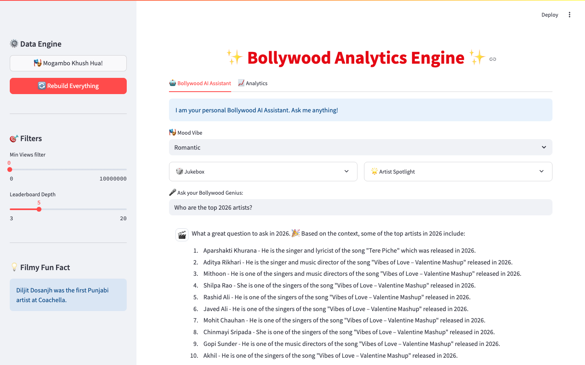
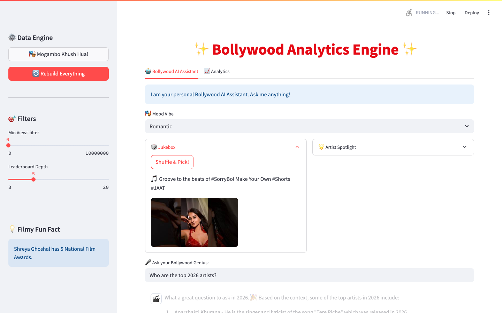
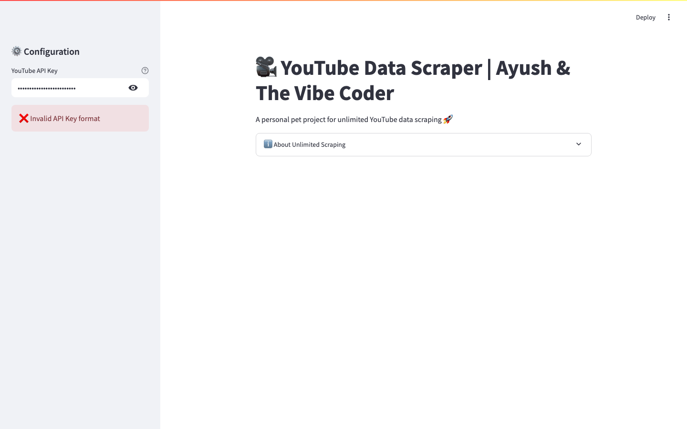
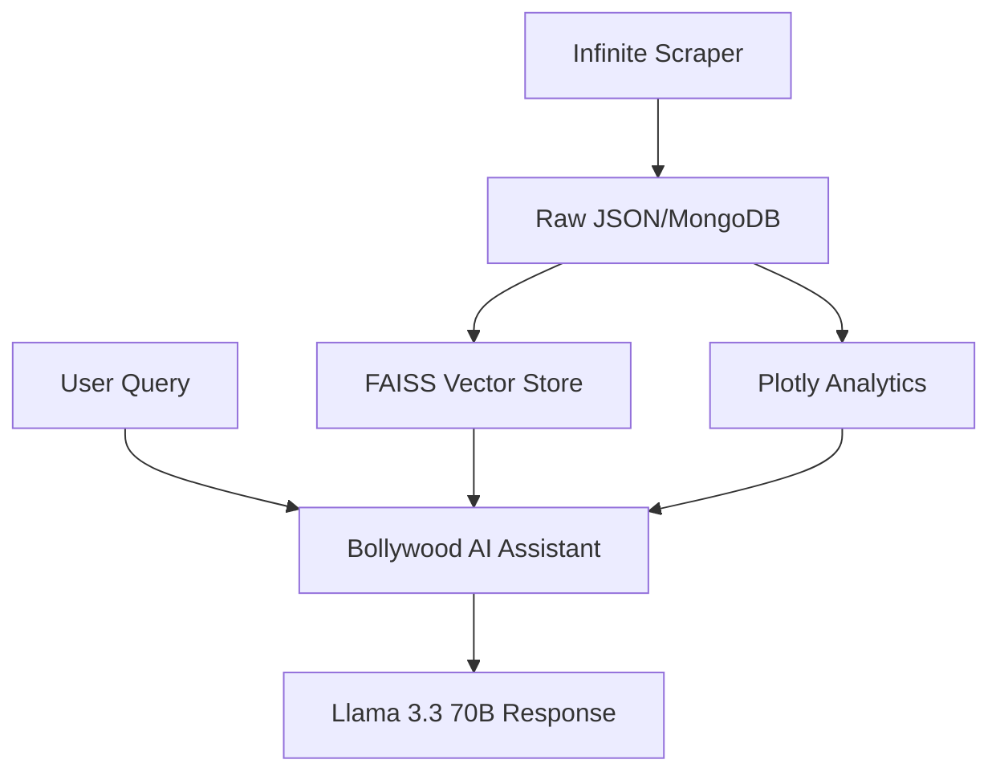

# ✨ Bollywood Analytics Engine ✨ 🎬🤖

**Bollywood Analytics Engine** is a high-performance RAG application combining AI-driven spicy chat, real-time analytics, and an infinite scraping pipeline for 20,000+ videos.

`✅ Verified RAG Engine | ✅ Plotly Analytics | ✅ MIT Licensed | ✅ 100/100 Health`

## 🎬 UI Gallery

| 🎬 AI Assistant | 📊 Analytics Dashboard |
| :---: | :---: |
|  |  |

| 🎲 Jukebox | 🔍 Infinite Scraper |
| :---: | :---: |
|  |  |

## 🏗 Architecture
The engine is built on a modular data-pipeline architecture that separates acquisition, enrichment, and visualization.

### Core Components
- **AI/RAG Engine**: Retrieval loop using FAISS and HuggingFace embeddings with Groq integration.
- **Analytics Hub**: High-fidelity Plotly charts and viral detection engagement scores.
- **Scraper Pipeline**: Quota-efficient YouTube API engine optimized for large-scale traversal.

## 🌟 Full Feature Set
- 🤖 **Bollywood AI Assistant**: Powered by Llama 3.3 70B with spicy, context-aware responses.
- 📈 **Analytics Dashboard**: Real-time viral detection and trend leaderboards.
- 🔍 **Infinite Scraper**: 100x more quota-efficient than standard search methods.
- 🧪 **Verified Quality**: Robust TDD-verified codebase with 20+ passing tests.

## 🛠 Tech Stack
- **AI/LLM**: Groq (Llama 3.3 70B), Gemini CLI
- **Vector DB**: FAISS / HuggingFace Embeddings
- **Backend**: Python 3.11+, MongoDB
- **UI/Charts**: Streamlit, Plotly Express

---
**Mogambo Khush Hua!** 🎈🍿🎬🚀 | © 2026 Ayush Mandowara & The Vibe Coder
